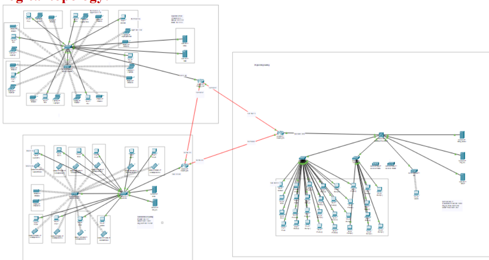

# Computer_Networks

This project is a complex engineering problem in which complete network for software house is to be developed.

1. Three buildings(offices) in Three different cities.
2. DHCP, DNS, FTP, HTTP, and Email services. 
3. Managing IP addresses of each devices in the network.

##### Talha Rehman ######
##### B.Sc. Electrical Engineering ######
##### Namal University Mianwali,Pakistan ######
