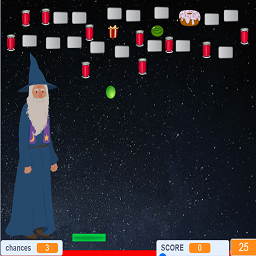
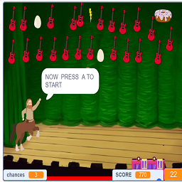
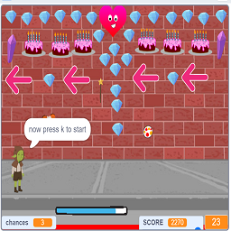

# Scratch_Game

This game was developed in 2018 in `https://scratch.mit.edu/` as a part of course Introduction to Computing Lab Final Task.

Upload the *sb3* file to Mit Scratch and run the game.

## Preview of Stages

##### Talha Rehman ###
##### B.Sc. Electrical Engineering ###
##### Namal University Mianwali, Pakistan ###
